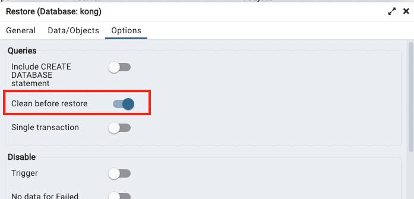

# Learn Kong Gateway + Deno as Upstream Services

## Prerequisites
Before jumping to how, you need to make sure you have this installed:
- [Docker](https://www.docker.com/get-started)
- [Docker Compose](https://docs.docker.com/compose/)

### Run project in local machine
- `docker-compose up -d`
- import `./backup/Insomnia_2022-11-27.json` API collections to insomnia
- restore the backup databases with `pgadmin4`
  